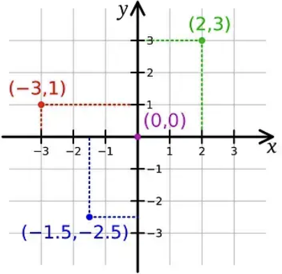

- [Multidimensional C-style Arrays](#multidimensional-c-style-arrays)
  - [Two-dimensional arrays](#two-dimensional-arrays)
    - [Multidimensional arrays](#multidimensional-arrays)
  - [How 2d arrays are laid out in memory](#how-2d-arrays-are-laid-out-in-memory)
  - [Initializing two-dimensional arrays](#initializing-two-dimensional-arrays)
  - [Two-dimensional arrays and loops](#two-dimensional-arrays-and-loops)
  - [A two-dimensional array example](#a-two-dimensional-array-example)
  - [Cartesian coordinates vs Array indices](#cartesian-coordinates-vs-array-indices)


# Multidimensional C-style Arrays


Consider a game like Tic-tac-toe. The standard board for this game is a 3×3 grid, with players taking turns placing ‘X’ and ‘O’ symbols. The first to get three symbols in a row wins.

While you could store the board data as 9 individual variables, we know that when you have multiple instances of an element, it’s better to use an array:

```cpp
int ttt[9]; // a C-style array of ints (value 0 = empty, 1 = player 1, 2 = player 2)
```

This defines a C-style array with 9 elements arranged sequentially in memory. We can imagine these elements laid out as a single row of values, like this:

```cpp
// ttt[0] ttt[1] ttt[2] ttt[3] ttt[4] ttt[5] ttt[6] ttt[7] ttt[8]
```

The dimension of an array is the number of indices needed to select an element. An array containing only a single dimension is called a single-dimensional array or a one-dimensional array (sometimes abbreviated as a 1d array). ttt above is an example of a one-dimensional array, as elements can be selected with a single index (e.g. ttt[2]).

But note that our one-dimensional array doesn’t look much like our tic-tac-toe board, which exists in two dimensions. We can do better.

## Two-dimensional arrays
In previous lessons, we noted that the elements of an array can be of any object type. This means the element type of an array can be another array! Defining such an array is simple:

```cpp
int a[3][5]; // a 3-element array of 5-element arrays of int
```
An array of arrays is called a two-dimensional array (sometimes abbreviated as a 2d array) because it has two subscripts.

With a two-dimensional array, it is convenient to think of the first (left) subscript as selecting the row, and the second (right) subscript as selecting the column. Conceptually, we can imagine this two-dimensional array laid out as follows:

```cpp
// col 0    col 1    col 2    col 3    col 4
// a[0][0]  a[0][1]  a[0][2]  a[0][3]  a[0][4]  row 0
// a[1][0]  a[1][1]  a[1][2]  a[1][3]  a[1][4]  row 1
// a[2][0]  a[2][1]  a[2][2]  a[2][3]  a[2][4]  row 2
```

To access the elements of a two-dimensional array, we simply use two subscripts:
```cpp
a[2][3] = 7; // a[row][col], where row = 2 and col = 3
```

Thus, for a Tic-tac-toe board, we can define a 2d array like this:

```cpp
int ttt[3][3];
```

And now we have a 3×3 grid of elements that we can easily manipulate using row and column indices!

### Multidimensional arrays
Arrays with more than one dimension are called multidimensional arrays.

C++ even supports multidimensional arrays with more than 2 dimensions:

```cpp
int threedee[4][4][4]; // a 4x4x4 array (an array of 4 arrays of 4 arrays of 4 ints)
```

For example, the terrain in Minecraft is divided into 16x16x16 blocks (called chunk sections).

Arrays with dimensions higher than 3 are supported, but rare.


## How 2d arrays are laid out in memory
Memory is linear (1-dimensional), so multidimensional arrays are actually stored as a sequential list of elements.

There are two possible ways for the following array to be stored in memory:

```cpp
// col 0   col 1   col 2   col 3   col 4
// [0][0]  [0][1]  [0][2]  [0][3]  [0][4]  row 0
// [1][0]  [1][1]  [1][2]  [1][3]  [1][4]  row 1
// [2][0]  [2][1]  [2][2]  [2][3]  [2][4]  row 2
```

C++ uses row-major order, where elements are sequentially placed in memory row-by-row, ordered from left to right, top to bottom:

```cpp
/*
[0][0] [0][1] [0][2] [0][3] [0][4] [1][0] [1][1] [1][2] [1][3] [1][4] [2][0] [2][1] [2][2] [2][3] [2][4]
*/
```
Some other languages (like Fortran) use column-major order, elements are sequentially placed in memory column-by-column, from top to bottom, left to right:

```cpp
/*
[0][0] [1][0] [2][0] [0][1] [1][1] [2][1] [0][2] [1][2] [2][2] [0][3] [1][3] [2][3] [0][4] [1][4] [2][4]
*/
```

In C++, when initializing an array, elements are initialized in row-major order. And when traversing an array, it is most efficient to access elements in the order they are laid out in memory.

## Initializing two-dimensional arrays
To initialize a two-dimensional array, it is easiest to use nested braces, with each set of numbers representing a row:

```cpp
int array[3][5]
{
  { 1, 2, 3, 4, 5 },     // row 0
  { 6, 7, 8, 9, 10 },    // row 1
  { 11, 12, 13, 14, 15 } // row 2
};
```

Although some compilers will let you omit the inner braces, we highly recommend you include them anyway for readability purposes.

When using inner braces, missing initializers will be value-initialized:

```cpp
int array[3][5]
{
  { 1, 2 },          // row 0 = 1, 2, 0, 0, 0
  { 6, 7, 8 },       // row 1 = 6, 7, 8, 0, 0
  { 11, 12, 13, 14 } // row 2 = 11, 12, 13, 14, 0
};
```

An initialized multidimensional array can omit (only) the leftmost length specification:

```cpp
int array[][5]
{
  { 1, 2, 3, 4, 5 },
  { 6, 7, 8, 9, 10 },
  { 11, 12, 13, 14, 15 }
};
```

In such cases, the compiler can do the math to figure out what the leftmost length is from the number of initializers.

Omitting non-leftmost dimensions is not allowed:

```cpp
int array[][]
{
  { 1, 2, 3, 4 },
  { 5, 6, 7, 8 }
};
```

Just like normal arrays, multidimensional arrays can still be initialized to 0 as follows:
```cpp
int array[3][5] {};
```

## Two-dimensional arrays and loops
With a one-dimensional array, we can use a single loop to iterate through all of the elements in the array:

```cpp
#include <iostream>

int main()
{
    int arr[] { 1, 2, 3, 4, 5 };

    // for-loop with index
    for (std::size_t i{0}; i < std::size(arr); ++i)
        std::cout << arr[i] << ' ';

    std::cout << '\n';

    // range-based for-loop
    for (auto e: arr)
        std::cout << e << ' ';

    std::cout << '\n';

    return 0;
}
```

With a two-dimensional array, we need two loops: one to select the row, and another to select the column.


And with two loops, we also need to determine which loop will be the outer loop, and which will be the inner loop. It is most efficient to access elements in the order they are laid out in memory. Since C++ uses row-major order, the row selector should be the outer loop, and the column selector should be the inner loop.

```cpp
#include <iostream>

int main()
{
    int arr[3][4] {
        { 1, 2, 3, 4 },
        { 5, 6, 7, 8 },
        { 9, 10, 11, 12 }};

    // double for-loop with indices
    for (std::size_t row{0}; row < std::size(arr); ++row) // std::size(arr) returns the number of rows
    {
        for (std::size_t col{0}; col < std::size(arr[0]); ++col) // std::size(arr[0]) returns the number of columns
            std::cout << arr[row][col] << ' ';

        std::cout << '\n';
    }

    // double range-based for-loop
    for (const auto& arow: arr)   // get each array row
    {
        for (const auto& e: arow) // get each element of the row
            std::cout << e << ' ';

        std::cout << '\n';
    }

    return 0;
}
```

## A two-dimensional array example
Let’s take a look at a practical example of a two-dimensional array:

```cpp
#include <iostream>

int main()
{
    constexpr int numRows{ 10 };
    constexpr int numCols{ 10 };

    // Declare a 10x10 array
    int product[numRows][numCols]{};

    // Calculate a multiplication table
    // We don't need to calc row and col 0 since mult by 0 always is 0
    for (std::size_t row{ 1 }; row < numRows; ++row)
    {
        for (std::size_t col{ 1 }; col < numCols; ++col)
        {
            product[row][col] = static_cast<int>(row * col);
        }
     }

    for (std::size_t row{ 1 }; row < numRows; ++row)
    {
        for (std::size_t col{ 1 }; col < numCols; ++col)
        {
            std::cout << product[row][col] << '\t';
        }

        std::cout << '\n';
     }


    return 0;
}
```

This program calculates and prints a multiplication table for all values between 1 and 9 (inclusive). Note that when printing the table, the for loops start from 1 instead of 0. This is to omit printing the 0 column and 0 row, which would just be a bunch of 0s! Here is the output:

```cpp
/*
1    2    3    4    5    6    7    8    9
2    4    6    8    10   12   14   16   18
3    6    9    12   15   18   21   24   27
4    8    12   16   20   24   28   32   36
5    10   15   20   25   30   35   40   45
6    12   18   24   30   36   42   48   54
7    14   21   28   35   42   49   56   63
8    16   24   32   40   48   56   64   72
9    18   27   36   45   54   63   72   81
*/
```

## Cartesian coordinates vs Array indices
In geometry, the Cartesian coordinate system is often used to describe the position of objects. In two dimensions, we have two coordinate axes, conventionally named “x” and “y”. “x” is the horizontal axis, and “y” is the vertical axis.



In two dimensions, the Cartesian position of an object can be described as an { x, y } pair, where x-coordinate and y-coordinate are values indicating how far to the right of the x-axis and how far above the y-axis an object is positioned. Sometimes the y-axis is flipped (so that the y-coordinate describes how far below the y-axis something is).

Now let’s take a look at our 2d array layout in C++:

```cpp
// col 0   col 1   col 2   col 3   col 4
// [0][0]  [0][1]  [0][2]  [0][3]  [0][4]  row 0
// [1][0]  [1][1]  [1][2]  [1][3]  [1][4]  row 1
// [2][0]  [2][1]  [2][2]  [2][3]  [2][4]  row 2
```

This is also a two-dimensional coordinate system, where the position of an element can be described as [row][col] (where the col-axis is flipped).

While each of these coordinate systems is fairly easy to understand independently, converting from Cartesian { x, y } to Array indices \[row]\[col] is a bit counter-intuitive.

The key insight is that the x-coordinate in a Cartesian system describes which column is being selected in the array indexing system. Conversely, the y-coordinate describes which row is being selected. Therefore, an { x, y } Cartesian coordinate translates to an \[y]\[x] array coordinate, which is backwards from what we might expect!

This leads to 2d loops that look like this:

```cpp
for (std::size_t y{0}; y < std::size(arr); ++y) // outer loop is rows / y
{
    for (std::size_t x{0}; x < std::size(arr[0]); ++x) // inner loop is columns / x
        std::cout << arr[y][x] << ' '; // index with y (row) first, then x (col)
```

Note that in this case, we index the array as a\[y]\[x], which is probably backwards from the alphabetic ordering you were expecting.
