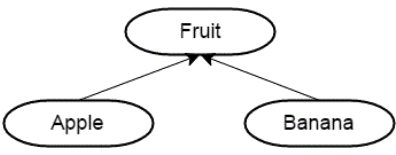
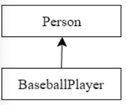
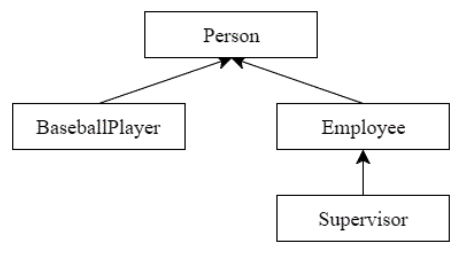

- [Basic inheritance in C++](#basic-inheritance-in-c)
  - [A Person class](#a-person-class)
  - [A BaseballPlayer class](#a-baseballplayer-class)
  - [Making BaseballPlayer a derived class](#making-baseballplayer-a-derived-class)
  - [An Employee derived class](#an-employee-derived-class)
  - [Inheritance chains](#inheritance-chains)
  - [Why is this kind of inheritance useful?](#why-is-this-kind-of-inheritance-useful)
  - [Conclusion](#conclusion)


# Basic inheritance in C++

Now that we’ve talked about what inheritance is in an abstract sense, let’s talk about how it’s used within C++.

Inheritance in C++ takes place between classes. In an inheritance (is-a) relationship, the class being inherited from is called the parent class, base class, or superclass, and the class doing the inheriting is called the child class, derived class, or subclass.




In the above diagram, Fruit is the parent, and both Apple and Banana are children.


In this diagram, Triangle is both a child (to Shape) and a parent (to Right Triangle).

A child class inherits both behaviors (member functions) and properties (member variables) from the parent (subject to some access restrictions that we’ll cover in a future lesson).
These variables and functions become members of the derived class.

Because child classes are full-fledged classes, they can (of course) have their own members that are specific to that class. We’ll see an example of this in a moment.

## A Person class

Here’s a simple class to represent a generic person:

```cpp
#include <string>
#include <string_view>

class Person
{
// In this example, we're making our members public for simplicity
public:
    std::string m_name{};
    int m_age{};

    Person(std::string_view name = "", int age = 0)
        : m_name{ name }, m_age{ age }
    {
    }

    const std::string& getName() const { return m_name; }
    int getAge() const { return m_age; }

};
```

Because this Person class is designed to represent a generic person, we’ve only defined members that would be common to any type of person. Every person (regardless of gender, profession, etc…) has a name and age, so those are represented here.

Note that in this example, we’ve made all of our variables and functions public. This is purely for the sake of keeping these examples simple right now. Normally we would make the variables private. We will talk about access controls and how those interact with inheritance later in this chapter.

## A BaseballPlayer class

Let’s say we wanted to write a program that keeps track of information about some baseball players. Baseball players need to contain information that is specific to baseball players -- for example, we might want to store a player’s batting average, and the number of home runs they’ve hit.


Here’s our incomplete Baseball player class:

```cpp
class BaseballPlayer
{
// In this example, we're making our members public for simplicity
public:
    double m_battingAverage{};
    int m_homeRuns{};

    BaseballPlayer(double battingAverage = 0.0, int homeRuns = 0)
       : m_battingAverage{battingAverage}, m_homeRuns{homeRuns}
    {
    }
};
```

Now, we also want to keep track of a baseball player’s name and age, and we already have that information as part of our Person class.

We have three choices for how to add name and age to BaseballPlayer:

1. Add name and age to the BaseballPlayer class directly as members. This is probably the worst choice, as we’re duplicating code that already exists in our Person class. Any updates to Person will have to be made in BaseballPlayer too.
2. Add Person as a member of BaseballPlayer using composition. But we have to ask ourselves, “does a BaseballPlayer have a Person”? No, it doesn’t. So this isn’t the right paradigm.
3. Have BaseballPlayer inherit those attributes from Person. Remember that inheritance represents an is-a relationship. Is a BaseballPlayer a Person? Yes, it is. So inheritance is a good choice here.

## Making BaseballPlayer a derived class

To have BaseballPlayer inherit from our Person class, the syntax is fairly simple. After the class BaseballPlayer declaration, we use a colon, the word “public”, and the name of the class we wish to inherit. This is called public inheritance. We’ll talk more about what public inheritance means in a future lesson.

```cpp
// BaseballPlayer publicly inheriting Person
class BaseballPlayer : public Person
{
public:
    double m_battingAverage{};
    int m_homeRuns{};

    BaseballPlayer(double battingAverage = 0.0, int homeRuns = 0)
       : m_battingAverage{battingAverage}, m_homeRuns{homeRuns}
    {
    }
};
```
Using a derivation diagram, our inheritance looks like this:




When BaseballPlayer inherits from Person, BaseballPlayer acquires the member functions and variables from Person. Additionally, BaseballPlayer defines two members of its own: m_battingAverage and m_homeRuns. This makes sense, since these properties are specific to a BaseballPlayer, not to any Person.

Thus, BaseballPlayer objects will have 4 member variables: m_battingAverage and m_homeRuns from BaseballPlayer, and m_name and m_age from Person.

This is easy to prove:

```cpp
#include <iostream>
#include <string>
#include <string_view>

class Person
{
public:
    std::string m_name{};
    int m_age{};

    Person(std::string_view name = "", int age = 0)
        : m_name{name}, m_age{age}
    {
    }

    const std::string& getName() const { return m_name; }
    int getAge() const { return m_age; }

};

// BaseballPlayer publicly inheriting Person
class BaseballPlayer : public Person
{
public:
    double m_battingAverage{};
    int m_homeRuns{};

    BaseballPlayer(double battingAverage = 0.0, int homeRuns = 0)
       : m_battingAverage{battingAverage}, m_homeRuns{homeRuns}
    {
    }
};

int main()
{
    // Create a new BaseballPlayer object
    BaseballPlayer joe{};
    // Assign it a name (we can do this directly because m_name is public)
    joe.m_name = "Joe";
    // Print out the name
    std::cout << joe.getName() << '\n'; // use the getName() function we've acquired from the Person base class

    return 0;
}
/* Which prints the value:

Joe */
```
This compiles and runs because joe is a BaseballPlayer, and all BaseballPlayer objects have a m_name member variable and a getName() member function inherited from the Person class.

## An Employee derived class

Now let’s write another class that also inherits from Person. This time, we’ll write an Employee class. An employee “is a” person, so using inheritance is appropriate:

```cpp
// Employee publicly inherits from Person
class Employee: public Person
{
public:
    double m_hourlySalary{};
    long m_employeeID{};

    Employee(double hourlySalary = 0.0, long employeeID = 0)
        : m_hourlySalary{hourlySalary}, m_employeeID{employeeID}
    {
    }

    void printNameAndSalary() const
    {
        std::cout << m_name << ": " << m_hourlySalary << '\n';
    }
};
```

Employee inherits m_name and m_age from Person (as well as the two access functions), and adds two more member variables and a member function of its own. Note that printNameAndSalary() uses variables both from the class it belongs to (Employee::m_hourlySalary) and the parent class (Person::m_name).

This gives us a derivation chart that looks like this:


Note that Employee and BaseballPlayer don’t have any direct relationship, even though they both inherit from Person.

Here’s a full example using Employee:

```cpp
#include <iostream>
#include <string>
#include <string_view>

class Person
{
public:
    std::string m_name{};
    int m_age{};

    Person(std::string_view name = "", int age = 0)
        : m_name{name}, m_age{age}
    {
    }

    const std::string& getName() const { return m_name; }
    int getAge() const { return m_age; }

};

// Employee publicly inherits from Person
class Employee: public Person
{
public:
    double m_hourlySalary{};
    long m_employeeID{};

    Employee(double hourlySalary = 0.0, long employeeID = 0)
        : m_hourlySalary{hourlySalary}, m_employeeID{employeeID}
    {
    }

    void printNameAndSalary() const
    {
        std::cout << m_name << ": " << m_hourlySalary << '\n';
    }
};

int main()
{
    Employee frank{20.25, 12345};
    frank.m_name = "Frank"; // we can do this because m_name is public

    frank.printNameAndSalary();

    return 0;
}
/* This prints:

Frank: 20.25 */
```

## Inheritance chains

It’s possible to inherit from a class that is itself derived from another class. There is nothing noteworthy or special when doing so -- everything proceeds as in the examples above.

For example, let’s write a Supervisor class. A Supervisor is an Employee, which is a Person. We’ve already written an Employee class, so let’s use that as the base class from which to derive Supervisor:

```cpp
class Supervisor: public Employee
{
public:
    // This Supervisor can oversee a max of 5 employees
    long m_overseesIDs[5]{};
};
```

Now our derivation chart looks like this:




All Supervisor objects inherit the functions and variables from both Employee and Person, and add their own m_overseesIDs member variable.

By constructing such inheritance chains, we can create a set of reusable classes that are very general (at the top) and become progressively more specific at each level of inheritance.


## Why is this kind of inheritance useful?

Inheriting from a base class means we don’t have to redefine the information from the base class in our derived classes. We automatically receive the member functions and member variables of the base class through inheritance, and then simply add the additional functions or member variables we want. This not only saves work, but also means that if we ever update or modify the base class (e.g. add new functions, or fix a bug), all of our derived classes will automatically inherit the changes!

For example, if we ever added a new function to Person, then Employee, Supervisor, and BaseballPlayer would automatically gain access to it. If we added a new variable to Employee, then Supervisor would also gain access to it. This allows us to construct new classes in an easy, intuitive, and low-maintenance way!

## Conclusion

Inheritance allows us to reuse classes by having other classes inherit their members. In future lessons, we’ll continue to explore how this works.
