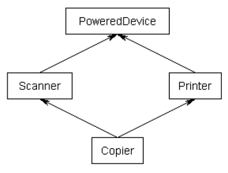
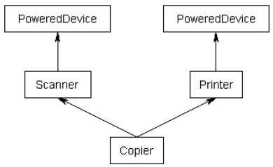

- [Virtual base classes](#virtual-base-classes)
  - [The diamond problem](#the-diamond-problem)
  - [Virtual base classes](#virtual-base-classes-1)


# Virtual base classes


Last chapter, in lesson 24.9 -- Multiple inheritance, we left off talking about the “diamond problem”. In this section, we will resume this discussion.

Note: This section is an advanced topic and can be skipped or skimmed if desired.

## The diamond problem

Here is our example from the previous lesson (with some constructors) illustrating the diamond problem:

```cpp
#include <iostream>

class PoweredDevice
{
public:
    PoweredDevice(int power)
    {
		std::cout << "PoweredDevice: " << power << '\n';
    }
};

class Scanner: public PoweredDevice
{
public:
    Scanner(int scanner, int power)
        : PoweredDevice{ power }
    {
		std::cout << "Scanner: " << scanner << '\n';
    }
};

class Printer: public PoweredDevice
{
public:
    Printer(int printer, int power)
        : PoweredDevice{ power }
    {
		std::cout << "Printer: " << printer << '\n';
    }
};

class Copier: public Scanner, public Printer
{
public:
    Copier(int scanner, int printer, int power)
        : Scanner{ scanner, power }, Printer{ printer, power }
    {
    }
};
```

Although you might expect to get an inheritance diagram that looks like this:




If you were to create a Copier class object, by default you would end up with two copies of the PoweredDevice class -- one from Printer, and one from Scanner. This has the following structure:




We can create a short example that will show this in action:

```cpp
int main()
{
    Copier copier{ 1, 2, 3 };

    return 0;
}
/* This produces the result:

PoweredDevice: 3
Scanner: 1
PoweredDevice: 3
Printer: 2 */
```
As you can see, PoweredDevice got constructed twice.

While this is often desired, other times you may want only one copy of PoweredDevice to be shared by both Scanner and Printer.

## Virtual base classes

To share a base class, simply insert the “virtual” keyword in the inheritance list of the derived class. This creates what is called a virtual base class, which means there is only one base object. The base object is shared between all objects in the inheritance tree and it is only constructed once. Here is an example (without constructors for simplicity) showing how to use the virtual keyword to create a shared base class:

```cpp
class PoweredDevice
{
};

class Scanner: virtual public PoweredDevice
{
};

class Printer: virtual public PoweredDevice
{
};

class Copier: public Scanner, public Printer
{
};
```

Now, when you create a Copier class object, you will get only one copy of PoweredDevice per Copier that will be shared by both Scanner and Printer.

However, this leads to one more problem: if Scanner and Printer share a PoweredDevice base class, who is responsible for creating it? The answer, as it turns out, is Copier. The Copier constructor is responsible for creating PoweredDevice. Consequently, this is one time when Copier is allowed to call a non-immediate-parent constructor directly:

```cpp
#include <iostream>

class PoweredDevice
{
public:
    PoweredDevice(int power)
    {
		std::cout << "PoweredDevice: " << power << '\n';
    }
};

class Scanner: virtual public PoweredDevice // note: PoweredDevice is now a virtual base class
{
public:
    Scanner(int scanner, int power)
        : PoweredDevice{ power } // this line is required to create Scanner objects, but ignored in this case
    {
		std::cout << "Scanner: " << scanner << '\n';
    }
};

class Printer: virtual public PoweredDevice // note: PoweredDevice is now a virtual base class
{
public:
    Printer(int printer, int power)
        : PoweredDevice{ power } // this line is required to create Printer objects, but ignored in this case
    {
		std::cout << "Printer: " << printer << '\n';
    }
};

class Copier: public Scanner, public Printer
{
public:
    Copier(int scanner, int printer, int power)
        : PoweredDevice{ power }, // PoweredDevice is constructed here
        Scanner{ scanner, power }, Printer{ printer, power }
    {
    }
};
This time, our previous example:

int main()
{
    Copier copier{ 1, 2, 3 };

    return 0;
}
/* produces the result:

PoweredDevice: 3
Scanner: 1
Printer: 2 */
```

As you can see, PoweredDevice only gets constructed once.

There are a few details that we would be remiss if we did not mention.

First, for the constructor of the most derived class, virtual base classes are always created before non-virtual base classes, which ensures all bases get created before their derived classes.

Second, note that the Scanner and Printer constructors still have calls to the PoweredDevice constructor. When creating an instance of Copier, these constructor calls are simply ignored because Copier is responsible for creating the PoweredDevice, not Scanner or Printer. However, if we were to create an instance of Scanner or Printer, those constructor calls would be used, and normal inheritance rules apply.

Third, if a class inherits one or more classes that have virtual parents, the most derived class is responsible for constructing the virtual base class. In this case, Copier inherits Printer and Scanner, both of which have a PoweredDevice virtual base class. Copier, the most derived class, is responsible for creation of PoweredDevice. Note that this is true even in a single inheritance case: if Copier singly inherited from Printer, and Printer was virtually inherited from PoweredDevice, Copier is still responsible for creating PoweredDevice.

Fourth, all classes inheriting a virtual base class will have a virtual table, even if they would normally not have one otherwise, and thus instances of the class will be larger by a pointer.

Because Scanner and Printer derive virtually from PoweredDevice, Copier will only be one PoweredDevice subobject. Scanner and Printer both need to know how to find that single PoweredDevice subobject, so they can access its members (because after all, they are derived from it). This is typically done through some virtual table magic (which essentially stores the offset from each subclass to the PoweredDevice subobject).
